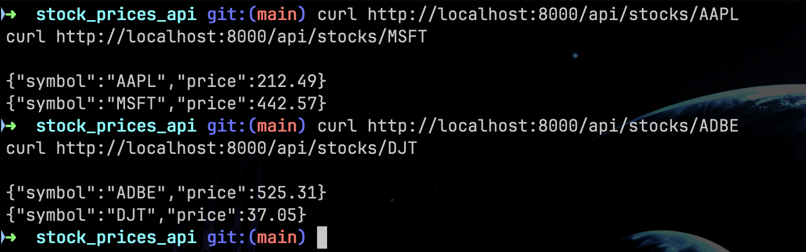

# Stock Price API in Golang



## Installation
### Prerequisites
Before you start make sure you have set up the following:  
- [Go](https://go.dev)
- API Key(free example website: [Alpha Vantage](https://www.alphavantage.co/))

### Building
1. Clone this repository:
```sh
git clone https://github.com/pesho65/stocks_api_go.git
```

## Usage
First run the main.go file while in the project folder

```sh
go run main.go
```
Then you give requests to the API using the following command:

```sh
curl http://localhost:8000/api/stocks/company_symbol
```


